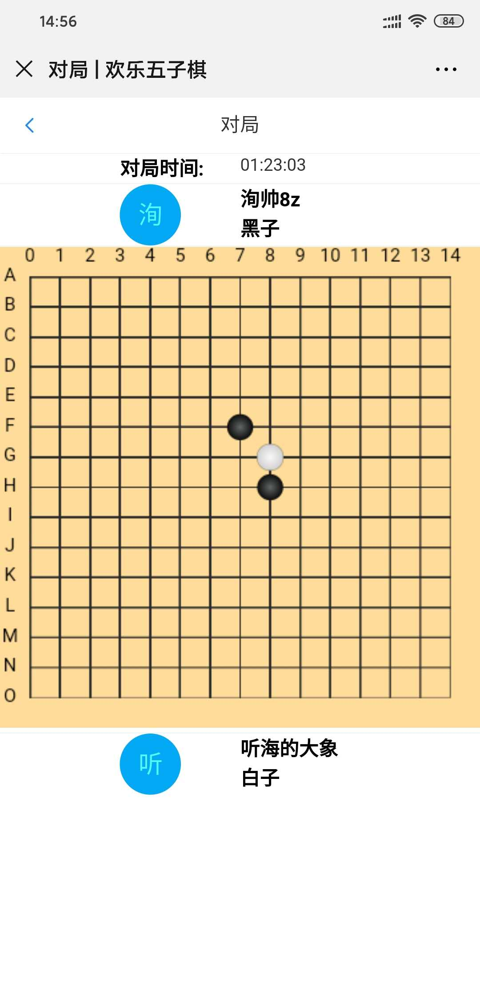
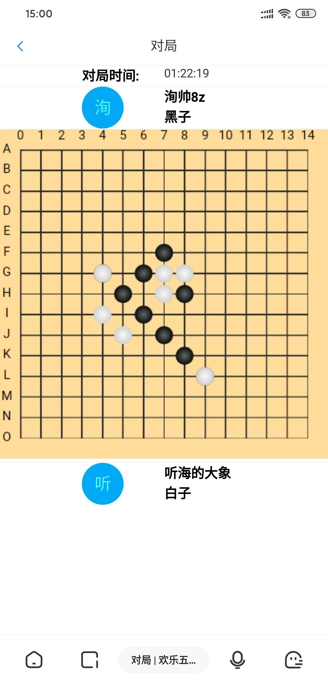
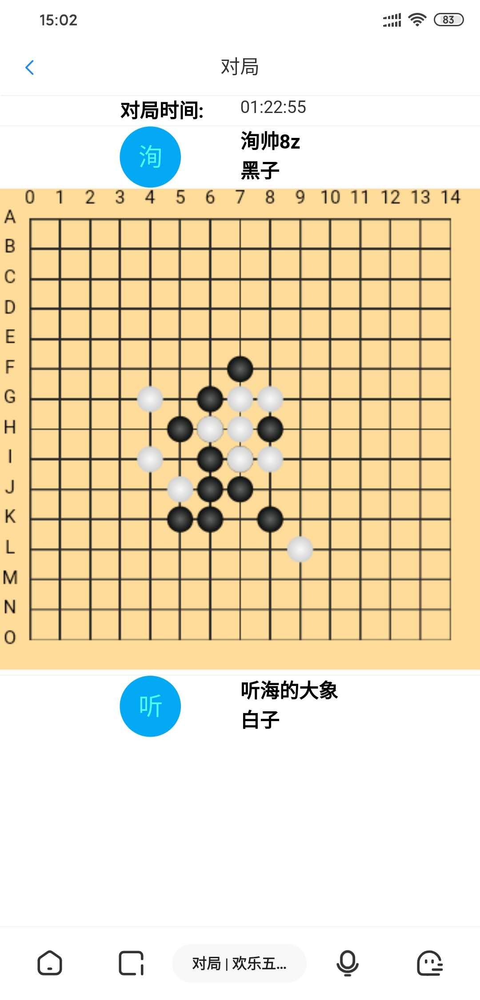
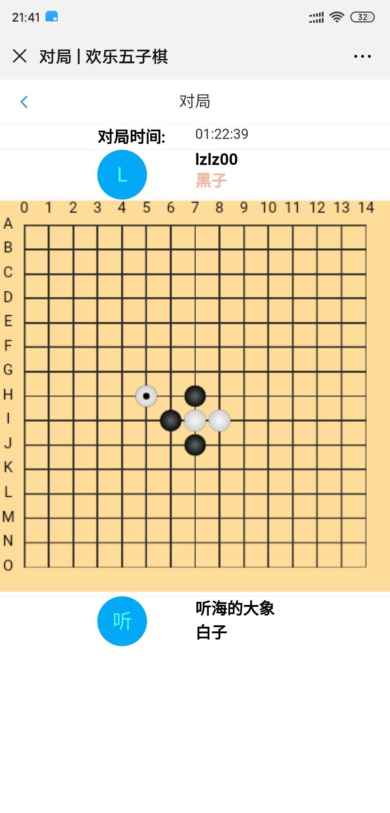

# gobang
前后端齐全的五子棋对战观战系统,前后端代码通过Maven打包到一个fatJar中,部署简单方便。

# 技术架构
- Spring Boot + Mybatis Plus + H2 Db
- WebSocket
- Canvas + Vue + Vue Router + Vuex + Vant

# TODO List
* [ ] 抽象出一个基于 `参与者`、`信令`、`房间状态机`三要素的小程序框架
* [ ] UI美化
* [ ] React Native 原生客户端 
* [ ] 基于Netty的自定义信令协议

# 图示

---

---

---

---
